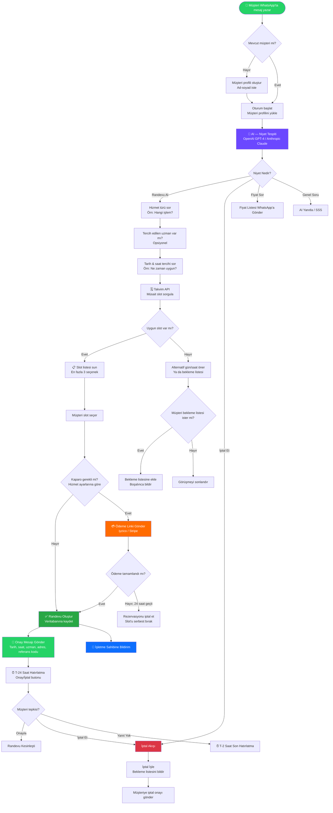
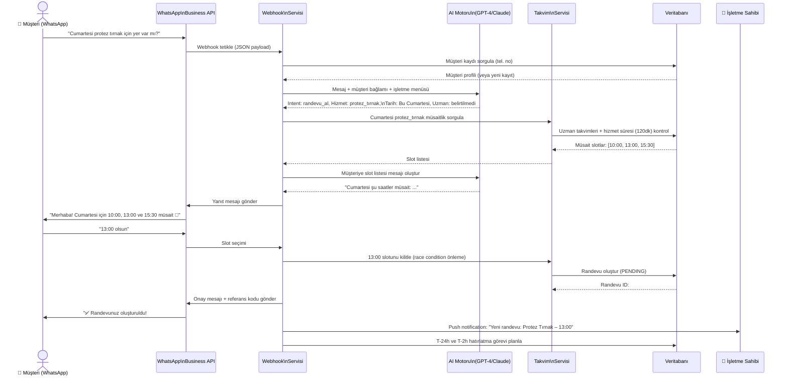
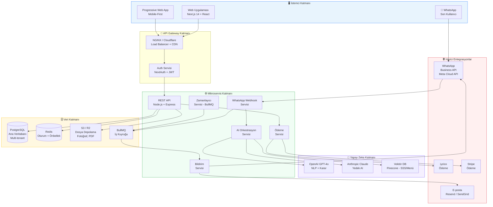
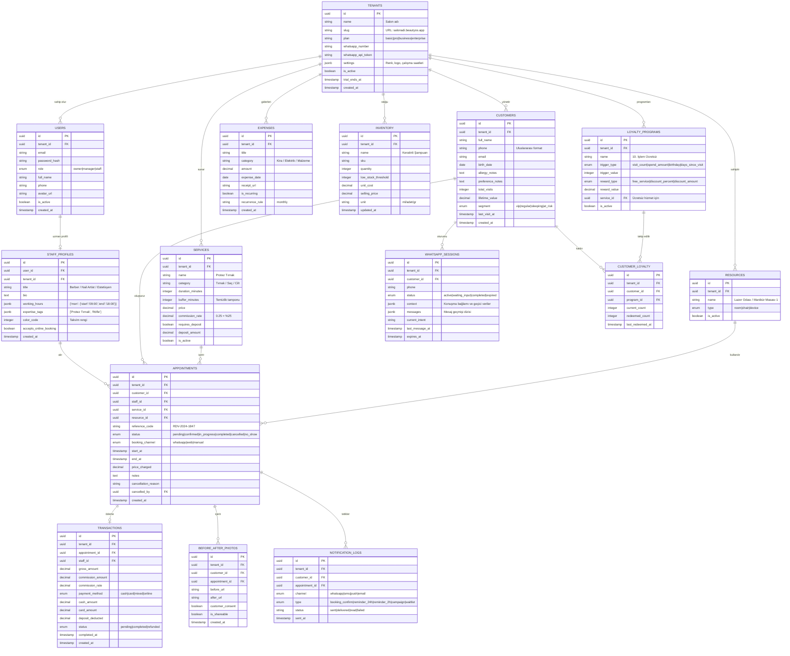
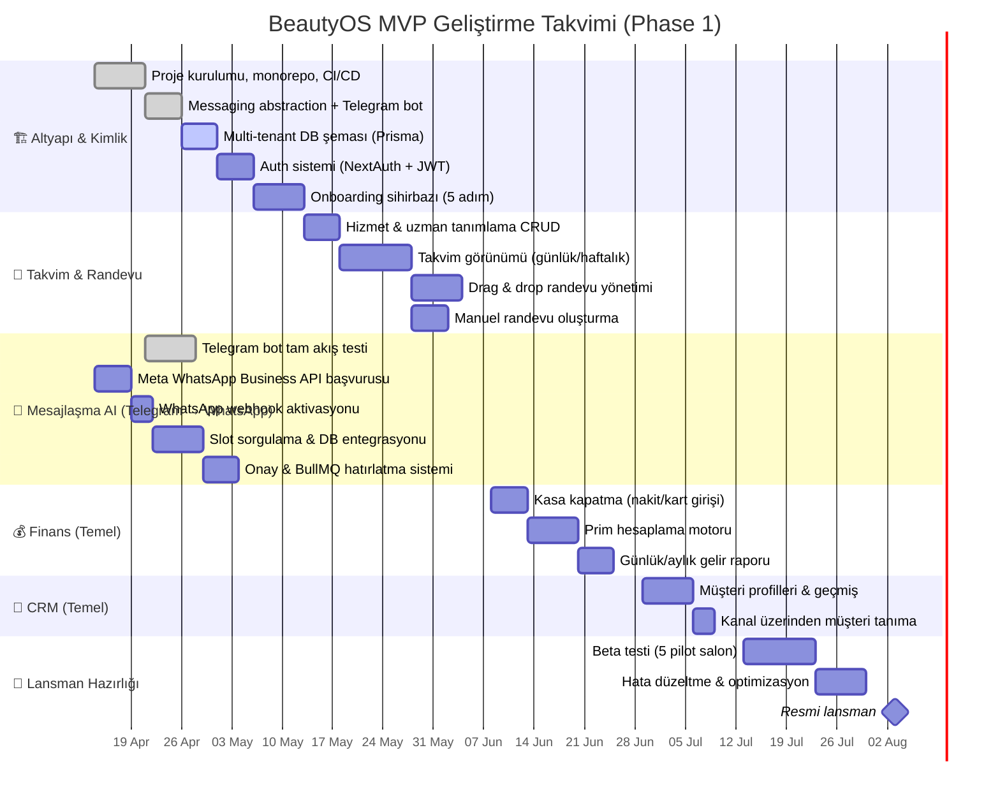
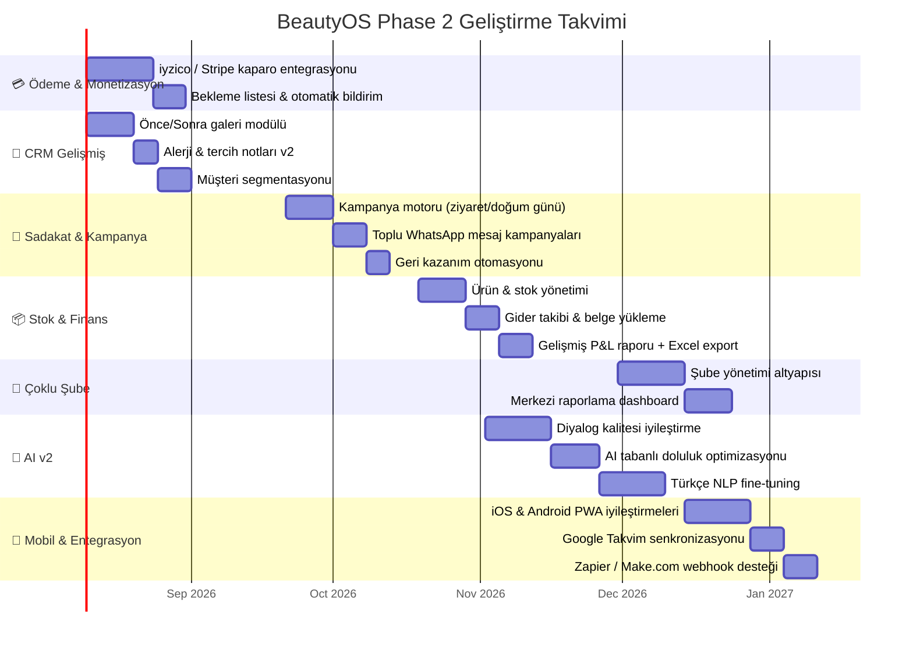
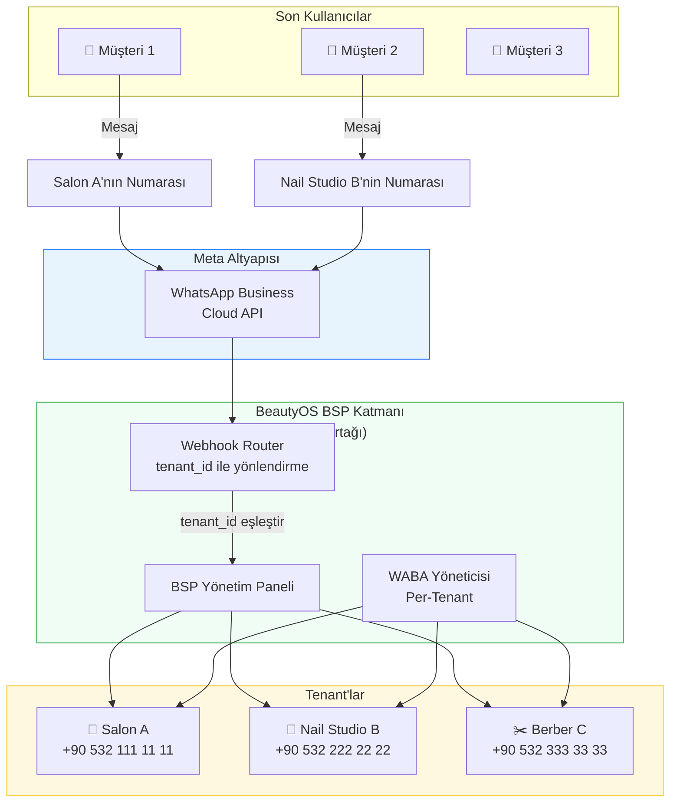

# BeautyOS — Güzellik & Bakım Sektörü İçin All-in-One SaaS Platformu
## Proje Gereksinim Dokümanı (PRD) v1.2

> **Durum:** Aktif Geliştirme | **Versiyon:** 1.2.0 | **Son Güncelleme:** Nisan 2026  
> **Hazırlayan:** Ürün, Mimari & Pazarlama Ekibi  
> **Hedef Kitle:** Yatırımcılar, Yazılım Ekibi, Paydaşlar

---

## Proje Durumu & Alınan Kararlar
> Bu bölüm, yeni bir Claude oturumu başlatırken hızlı bağlam kurmak için tasarlanmıştır.  
> Tüm kritik kararları ve güncel geliştirme durumunu özetler.

### Geliştirme Durumu (Nisan 2026)

**Son güncelleme: 20 Nisan 2026**

| Bileşen | Durum | Notlar |
|---|---|---|
| PRD & Mimari | ✅ Tamamlandı | v1.2, maliyet analizi ve risk bölümleri dahil |
| Agent Ekibi (12 agent) | ✅ Tamamlandı | `agents/` klasöründe, her domain için ayrı .md |
| Messaging Abstraction Layer | ✅ Tamamlandı | `apps/api/src/channels/` — Telegram + WhatsApp stub |
| Telegram Bot (AI akışı) | ✅ Canlıda | Gemini 2.5 Flash/Pro, Redis session, tam booking flow test edildi |
| Railway Deployment | ✅ Canlıda | `https://beautyosapi-production.up.railway.app` — tüm env var'lar set |
| Supabase (PostgreSQL) | ✅ Bağlı | Session pooler üzerinden IPv4 bağlantısı, Prisma hazır |
| Redis (Upstash) | ✅ Bağlı | TLS bağlantısı aktif, session yönetimi çalışıyor |
| Gemini API | ✅ Bağlı | Billing aktif — gemini-2.5-flash (intent) + gemini-2.5-pro (karmaşık tur) |
| WhatsApp Bot | ⏳ Beklemede | Meta BSP onayı bekleniyor — stub hazır, geçiş 1-2 gün |
| Prisma Şeması | ❌ Başlanmadı | Sıradaki kritik görev |
| Frontend (Next.js) | ❌ Başlanmadı | Faza 2'de başlanacak |
| Ödeme (iyzico/Stripe) | ❌ Başlanmadı | Phase 1 dışı kapsam |

### Kritik Mimari Kararlar

1. **Telegram-first geliştirme:** Meta WhatsApp API onayı 2-8 hafta sürdüğü için geliştirme ve testler Telegram üzerinden yürütülüyor. WhatsApp geçişi sıfır kod değişikliği gerektirir.
2. **Messaging Abstraction Layer:** `MessagingChannel` interface'i tüm kanalları soyutlar. Bot mantığı (AI, session, flow) kanala bağımlı değildir.
3. **AI: OpenAI → Gemini geçişi (20 Nisan 2026):** GPT-4o yerine Gemini 2.5 Flash (ekonomik, intent) + Gemini 2.5 Pro (karmaşık diyalog) kullanılıyor. Maliyet %60+ düşük, Gemini görüntü üretimi (Faza 2) da aynı API ile kullanılabilir.
4. **BSP Stratejisi:** Phase 1'de 360dialog üzerinden BSP ortağı, Phase 2'de direkt Meta BSP başvurusu (%30 maliyet düşüşü).
5. **Multi-tenant DB:** Paylaşımlı şema + `tenant_id` + PostgreSQL RLS politikaları.
6. **Fiyatlandırma revizyonu:** Eski ₺299-₺1.199 negatif margin'e yol açıyordu. Yeni: ₺499-₺1.999 (bkz. Bölüm 8).
7. **Supabase Session Pooler:** Direkt DB bağlantısı (port 5432) IPv4 uyumsuz. Session Pooler (`aws-0-eu-west-1.pooler.supabase.com:5432`) kullanılıyor.

### Proje Klasör Yapısı

```
BeautyOS/
├── PRD_BeautySaaS.md          — Bu dosya (tek kaynak of truth)
├── agents/                    — 12 uzman AI agent tanımı
│   ├── README.md              — Agent kullanım rehberi
│   ├── 01_frontend.md         — Next.js / React / Tailwind
│   ├── 02_backend.md          — Node.js / Express / Prisma
│   ├── 03_whatsapp_ai.md      — NLP / Bot akışı / Prompt mühendisliği
│   ├── 04_marketing.md        — Facebook / Instagram / Büyüme
│   ├── 05_visual_design.md    — NanoBanana / Marka / Görseller
│   ├── 06_database.md         — PostgreSQL / Redis / Veri
│   ├── 07_security.md         — OWASP / KVKK / AppSec
│   ├── 08_payment.md          — iyzico / Stripe / Kaparo
│   ├── 09_devops.md           — CI/CD / Vercel / Railway
│   ├── 10_analytics.md        — PostHog / KPI / Büyüme
│   ├── 11_seo_content.md      — SEO / Blog / Landing Page
│   └── 12_product.md          — Sprint / User Story / Onboarding
└── apps/
    └── api/                   — Express backend (aktif geliştirme)
        └── src/
            ├── channels/      — Messaging abstraction (Telegram ✅ / WhatsApp stub)
            ├── session/       — Redis oturum yönetimi
            ├── ai/            — Intent servisi (GPT-4o hibrit)
            ├── bot/           — Flow handler (3 katman hata yönetimi)
            └── routes/        — Webhook endpoint'leri
```

### Bir Sonraki Oturumda Yapılacaklar (Öncelik Sırası)

> **Altyapı tamamen hazır ve canlı.** Sıradaki görevler iş mantığına odaklanıyor.

1. **Prisma şeması yaz** — `Tenant`, `Salon`, `Staff`, `Service`, `Appointment`, `Customer` modelleri (Database Agent ile)
2. **Gerçek slot sorgusu** — Mock `['10:00', '13:00', '15:30']` yerine DB'den müsait saatler
3. **Randevu DB'ye kaydet** — `confirmBooking()` içindeki TODO'yu gerçek Prisma insert ile doldur
4. **Sentry entegrasyonu** — Production hata takibi
5. **Vercel** — Frontend başlamadan önce CI/CD altyapısı

**Canlı servisler özeti:**
- API: `https://beautyosapi-production.up.railway.app`
- Telegram bot: `@BeautyOSBot` — tam booking flow çalışıyor
- DB: Supabase PostgreSQL (Session Pooler)
- Cache/Session: Upstash Redis (TLS)
- AI: Google Gemini (billing aktif)

---

## İçindekiler

1. [Executive Summary & Value Proposition](#1-executive-summary--value-proposition)
2. [User Personas & Pain Points](#2-user-personas--pain-points)
3. [Feature Breakdown](#3-feature-breakdown)
4. [AI WhatsApp Booking Flow](#4-ai-whatsapp-booking-flow)
5. [Teknik Mimari & Veritabanı Şeması](#5-teknik-mimari--veritabanı-şeması)
6. [MVP & Phase 2 Roadmap](#6-mvp--phase-2-roadmap)
7. [WhatsApp Business API Mimarisi (BSP Modeli)](#7-whatsapp-business-api-mimarisi-bsp-modeli)
8. [Maliyet Modeli & Birim Ekonomisi](#8-maliyet-modeli--birim-ekonomisi)
9. [Risk Analizi](#9-risk-analizi)

---

## 1. Executive Summary & Value Proposition

### 1.1 Proje Özeti

**BeautyOS**, Türkiye'deki ve dünya genelindeki berber, kuaför, güzellik merkezi, nail art stüdyosu ve spa işletmelerini hedef alan, yapay zeka destekli, **web tabanlı bir B2B2C SaaS** platformudur.

Platform, iki temel problemi eş zamanlı olarak çözer:

- **İşletme tarafı:** Randevu takvimi, müşteri yönetimi (CRM), personel prim hesaplaması ve ön muhasebe işlemlerini **tek ekranda** birleştirir.
- **Müşteri tarafı:** Son kullanıcıların herhangi bir uygulama indirmeden, sadece **WhatsApp üzerinden** yapay zeka ile doğal dil kullanarak randevu almasını sağlar.

### 1.2 Temel Değer Önerisi (Value Proposition)

| Paydaş | Sorun | BeautyOS Çözümü |
|---|---|---|
| **İşletme Sahibi** | 4-5 farklı araç (takvim, defter, WhatsApp, Excel) kullanmak zorunda kalıyor | Tek platformda tam kontrol |
| **Personel/Uzman** | Prim hesaplamalarına güvenmiyor, takvimini göremez | Şeffaf, anlık prim ve kişisel takvim |
| **Müşteri** | Randevu almak için aramak ya da DM atmak zorunda, yanıt bekleniyor | 7/24 WhatsApp AI ile anında randevu |

### 1.3 Pazar Fırsatı

- Türkiye'de **150.000+** aktif berber, kuaför ve güzellik merkezi bulunmaktadır.
- Bu işletmelerin **%78'i** hâlâ telefon ve kağıt defteriyle randevu yönetmektedir.
- Küresel "Beauty & Wellness Software" pazarı 2027'de **$8.9 milyar** büyüklüğe ulaşacak şekilde büyümektedir.
- Mevcut çözümler (Fresha, Booksy, Treatwell) Türkiye pazarına tam lokalize değildir ve WhatsApp entegrasyonu sunmamaktadır.

### 1.4 Gelir Modeli (SaaS)

> ⚠️ **v1.1 Güncelleme:** Fiyatlandırma, Bölüm 8'deki birim ekonomisi analizine göre yeniden hesaplanmıştır. Eski fiyatlar (₺299–₺1.199) WhatsApp API ve AI maliyetleri hesaba katılmadan belirlenmişti; negatif marjına yol açıyordu.

```
Başlangıç    → ₺499/ay   (1 uzman, takvim + CRM + finans temel)
                           WhatsApp AI: 50 randevu/ay dahil, üstü ₺3/randevu
Profesyonel  → ₺999/ay   (5 uzmana kadar, tüm modüller)
                           WhatsApp AI: 300 randevu/ay dahil, üstü ₺2/randevu
İşletme      → ₺1.999/ay (Sınırsız uzman, tüm modüller + öncelikli destek)
                           WhatsApp AI: Sınırsız, gelişmiş AI model
Kurumsal     → Özel fiyat (Zincir işletmeler, API erişimi, SLA garantisi)
```

**Ek Gelirler:**
- Ödeme işlem komisyonu (%1.5 kaparo işlemleri üzerinden)
- WhatsApp AI aşım ücretleri (overage)
- SMS/E-posta hatırlatma paketi (₺99/ay ek)
- Önce/Sonra galeri paylaşım premium özelliği (₺149/ay ek)

**Neden Yeni Fiyatlar?**
Bölüm 8'de detaylandırıldığı üzere, yalnızca WhatsApp Business API + AI maliyetleri orta yoğunluklu bir salondan aylık ₺250–400 değişken maliyet üretmektedir. ₺299'luk eski temel plan bu maliyetleri karşılayamaz.

---

## 2. User Personas & Pain Points

### 2.1 Persona 1 — Ayşe: İşletme Sahibi / Salon Müdürü

```
Yaş: 38 | Meslek: 12 çalışanlı güzellik merkezi sahibi
Teknik Seviye: Orta | Cihaz: iPhone + masaüstü
Motivasyon: İşi büyütmek, personelini adil yönetmek, giderlerini kontrol etmek
```

**Acı Noktaları (Pain Points):**
- Personelin primlerini Excel'de manuel hesaplamak saatler alıyor ve hata yapıyor.
- Müşterilerden gelen WhatsApp mesajlarına yetiştiremiyor, randevular kaçıyor.
- Aylık gider/gelir dengesini görmek için muhasebecisini aramak zorunda kalıyor.
- Hangi hizmetin en çok gelir getirdiğini bilmiyor.

**Başarı Kriterleri:**
- Prim hesaplamaları otomatik ve şeffaf olmalı.
- Akşam eve gittiğinde sanal asistan müşteri mesajlarını zaten yanıtlamış olmalı.
- Aylık kâr/zarar raporunu tek tıkla görebilmeli.

---

### 2.2 Persona 2 — Emre: Uzman Personel (Berber/Nail Artist)

```
Yaş: 26 | Meslek: Nail art uzmanı (kıdemli çalışan)
Teknik Seviye: Yüksek | Cihaz: Android telefon
Motivasyon: Hak ettiği primi almak, müşteri tabanını büyütmek
```

**Acı Noktaları:**
- Hangi işlemden ne kadar prim alacağını bilmiyor, patrona güvenmek zorunda.
- Kendi randevularını görmek için her seferinde patronu aramak zorunda.
- Müşteri notlarına (alerji, tercih) erişimi yok, her seferinde yeniden soruyor.

**Başarı Kriterleri:**
- Kendi takvimini ve birikmiş primini her an telefondan görebilmeli.
- Müşteri kartına randevu öncesi bakıp hazırlanabilmeli.

---

### 2.3 Persona 3 — Zeynep: Son Kullanıcı (Müşteri)

```
Yaş: 29 | Meslek: Çalışan kadın
Teknik Seviye: Orta | Cihaz: iPhone (WhatsApp ağır kullanıcı)
Motivasyon: Hızlı ve zahmetsiz randevu, güvenilir hatırlatma
```

**Acı Noktaları:**
- Salonu aradığında hat meşgul ya da kimse açmıyor.
- Instagram DM'den mesaj atıp saatlerce yanıt beklemiş.
- Randevusunu unutup gitmeyen arkadaşı yüzünden sıkıntı yaşamış.
- Uygulama indirmek istemiyor.

**Başarı Kriterleri:**
- WhatsApp'tan saniyeler içinde randevu alabilmeli.
- Randevu öncesi otomatik hatırlatma gelmeli.
- İptal etmek istediğinde de WhatsApp'tan kolayca yapabilmeli.

---

## 3. Feature Breakdown

### 3.1 Modül 1: AI Destekli WhatsApp Otomasyon Motoru

#### 3.1.1 Doğal Dil Anlama (NLP)

- **Niyet Tespiti:** "Randevu al", "İptal et", "Yer var mı?", "Fiyat nedir?" niyetlerini sınıflandırma.
- **Varlık Çıkarma (Entity Extraction):** Hizmet türü, tercih edilen uzman, tarih/saat aralığı, kişi sayısı.
- **Belirsiz Girdi Yönetimi:** "Hafta sonu" → "Bu cumartesi mi, gelecek cumartesi mi?" şeklinde netleştirme.
- **Çok Turlu Diyalog:** Oturum bazlı bellek ile bağlamı koruma.
- **Dil Desteği:** Türkçe (öncelikli), İngilizce genişletme (Phase 2).

#### 3.1.2 Takvim Sorgulama & Slot Optimizasyonu

- Gerçek zamanlı müsaitlik sorgulama (API önbellekli, <200ms).
- Tercih edilen uzmanda slot yoksa otomatik alternatif uzman önerme.
- "En yakın uygun slot" algoritması (işlem süresi + tampon süresi hesaba katılarak).
- Randevu çakışma önleme kilitleme mekanizması (race condition protection).

#### 3.1.3 Otomatik Randevu Oluşturma

- Uzman onayı **beklenmeden** anında randevu kaydı.
- İşletme sahibine push notification + WhatsApp özet mesajı.
- Müşteriye onay mesajı (tarih, saat, uzman adı, adres, harita linki).
- Randevuya özel benzersiz referans kodu oluşturma.

#### 3.1.4 Hatırlatma & Bekleme Listesi

- **T-24 saat:** Randevu hatırlatma mesajı (onay/iptal butonu ile).
- **T-2 saat:** Son hatırlatma mesajı.
- İptal durumunda bekleme listesindeki müşterilere otomatik bildirim.
- Müşteri "Bildir" yazarsa bekleme listesine ekleme.

#### 3.1.5 Opsiyonel: Kaparo Tahsilatı

- Yüksek maliyetli işlemlerde (protez tırnak, komple bakım vb.) kaparo zorunluluğu.
- iyzico veya Stripe ödeme linki WhatsApp üzerinden gönderme.
- Kaparo alınmadan randevu slot'u kesinleşmez (24 saat süreli rezervasyon kilidi).
- İptal politikası yönetimi (X saat öncesine kadar tam iade).

---

### 3.2 Modül 2: Akıllı Takvim & Slot Yönetimi

#### 3.2.1 Takvim Görünümleri

- Günlük, haftalık, aylık görünüm.
- **Çoklu Personel Görünümü:** Yan yana sütunlarda tüm uzmanların takvimleri.
- **Oda/Cihaz Görünümü:** Lazer odası, manikür masası, pedikür koltuğu bazlı kaynak yönetimi.
- Renk kodlaması: Hizmet tipine göre otomatik renk atama.

#### 3.2.2 Randevu Yönetimi (Drag & Drop)

- Sürükle-bırak ile randevu taşıma ve yeniden zamanlama.
- Randevu üzerine tıklayarak hızlı düzenleme (hizmet, süre, not, ücret).
- Grup randevusu: Birden fazla müşteri/hizmet kombinasyonu.
- Blokaj randevusu: Öğle molası, tatil, özel etkinlik.

#### 3.2.3 Dinamik Hizmet Süreleri

- Her hizmet için özelleştirilebilir süre (dakika cinsinden).
- Temizleme/hazırlık tampon süresi (örneğin: Komple boyama sonrası 15 dk. temizlik).
- Uzman bazında farklı süreler (kıdemli berber kesimi 20 dk., stajyer 40 dk.).

#### 3.2.4 Çalışma Saatleri & İzin Yönetimi

- Uzman bazlı çalışma saati tanımlama (haftalık şablon).
- Bayram/tatil günleri tanımlama (salon geneli veya uzman bazlı).
- Kısmi gün izni (yarım gün, saatlik).

---

### 3.3 Modül 3: Finans, Ön Muhasebe & Personel Hakediş

#### 3.3.1 Kasa & Ödeme Yönetimi

- İşlem tamamlandığında nakit / kredi kartı / nakit+kart karma girişi.
- Günlük kasa kapatma özeti (toplam gelir, ödeme yöntemine göre kırılım).
- Yazar kasa fişi benzeri dijital makbuz oluşturma (PDF indirilebilir).
- Kaparo düşme: Online alınan kaparolar otomatik olarak bakiyeye mahsup.

#### 3.3.2 Dinamik Prim Sistemi

- **Hizmet bazlı prim:** Her hizmet kalemi için farklı prim yüzdesi tanımlama.
  - Örnek: Saç kesimi %20, Röfle %25, Komple boyama %30.
- **Ürün satışı primi:** Sattıkları ürünlerden ek prim.
- **Performans primleri:** Aylık hedef aşımında bonus prim katmanı.
- Prim özeti: Personelin görebileceği şeffaf prim tablosu (işlem bazlı döküm).
- Aylık hakediş raporu (işletme sahibi için ödenecek tutar özeti).

#### 3.3.3 Gider Takibi

- Gider kategorileri: Kira, elektrik, su, malzeme, personel maaşı, reklam vb.
- Tekrar eden giderler (aylık kira otomatik giriş).
- Gider belgesi (fatura/fiş) fotoğrafı yükleme.

#### 3.3.4 Stok & Sarf Malzeme Takibi

- Ürün kataloğu: Şampuan, boya, oje, krem vb.
- Hizmet başına tüketilen malzeme tanımlama (maliyet hesabı için).
- Kritik stok eşiği uyarısı (örneğin: Kalan stok 5 adedinin altına düştüğünde).
- Aylık malzeme maliyet raporu.

#### 3.3.5 Finansal Raporlar

- **Günlük:** Kasa durumu, işlem sayısı, kişi başı ortalama gelir.
- **Haftalık:** En çok gelir getiren hizmetler/uzmanlar.
- **Aylık:** Gelir-Gider tablosu, brüt kâr marjı, büyüme trendi.
- Veri dışa aktarma: Excel (.xlsx) ve PDF formatı.

---

### 3.4 Modül 4: CRM & Sadakat Yönetimi

#### 3.4.1 Müşteri Profilleri

- Temel bilgiler: Ad-soyad, telefon, doğum tarihi, Instagram (opsiyonel).
- Tıbbi/kozmetik notlar: Alerji, hassasiyet, kullanılan ürün geçmişi.
- Tercih notları: Tercih ettiği uzman, saç renk kodu, tırnak şekli tercihleri.
- İşlem geçmişi: Tarih, hizmet, uzman, ücret, kullanılan ürün.
- Yaşam boyu değer (LTV) hesaplama.

#### 3.4.2 Önce/Sonra Galerisi

- Müşteri dosyasına randevu bazlı fotoğraf yükleme (önce/sonra ikili görünüm).
- Fotoğraf paylaşım izni: Müşteriden WhatsApp üzerinden onay alma.
- Paylaşılabilir galeri linki (Instagram story için optimize edilmiş).

#### 3.4.3 Otomatik Kampanya & Sadakat

- **Ziyaret bazlı ödül:** "10. işlem ücretsiz" veya "%20 indirim" otomatik tanımlama.
- **Doğum günü kampanyası:** Doğum gününden X gün önce özel indirim WhatsApp mesajı.
- **Geri kazanım:** Son X günde gelmeyen müşteriye otomatik "Sizi özledik" mesajı.
- **Doldurma hatırlatması:** Röfle, tırnak dolumu için önerilen yenileme periyodunda hatırlatma.
- Kampanya performans raporu (gönderim, açılma, dönüşüm).

#### 3.4.4 Müşteri Segmentasyonu

- VIP (aylık 2+ ziyaret veya yüksek harcama), Düzenli, Uyuyan, Riskli segmentleri.
- Segmente özel toplu WhatsApp kampanyası gönderme.

---

### 3.5 Modül 5: İşletme Yönetim Paneli (Dashboard)

- Anlık KPI widget'ları: Bugünün geliri, bekleyen randevular, doluluk oranı.
- Personel performans tablosu (sıralama, karşılaştırma).
- Takvim doluluk ısı haritası (hangi saatler/günler en yoğun).
- Bildirim merkezi: Yeni randevu, iptal, stok uyarısı, ödeme bildirimleri.

---

### 3.6 Modül 6: İşletme Onboarding & Ayarlar

- Rehberli kurulum sihirbazı (5 adımda salon açma).
- Hizmet menüsü yönetimi (kategori, isim, süre, fiyat, prim oranı).
- Uzman profili: Fotoğraf, biyografi, uzmanlıklar, çalışma saatleri.
- WhatsApp numarası bağlama (WhatsApp Business API entegrasyonu).
- Marka özelleştirme: Logo, renk paleti, karşılama mesajı.
- Abonelik & fatura yönetimi.

---

## 4. AI WhatsApp Booking Flow

### 4.1 Uçtan Uca Randevu Akışı



### 4.2 AI Karar Motoru Detay Akışı



---

## 5. Teknik Mimari & Veritabanı Şeması

### 5.1 Yüksek Seviye Sistem Mimarisi



### 5.2 Multi-Tenant Veritabanı Mimarisi

> **Strateji:** Paylaşımlı şema (shared schema) + `tenant_id` izolasyonu. Her tabloda `tenant_id` foreign key ile kiracı verisi ayrımı. Performanslı sorgular için Row-Level Security (RLS) ile PostgreSQL politikaları.



### 5.3 Teknoloji Yığını (Tech Stack)

> ✅ = Onaylandı ve kullanımda | 🔄 = Seçildi, henüz implemente edilmedi

| Katman | Teknoloji | Durum | Gerekçe |
|---|---|---|---|
| **Frontend** | Next.js 14 (App Router) + TypeScript | 🔄 | SSR/SSG, SEO, PWA desteği |
| **UI Kütüphanesi** | Tailwind CSS + shadcn/ui | 🔄 | Hızlı geliştirme, mobil öncelikli |
| **Backend API** | Node.js 20 + Express + TypeScript | ✅ | Kuruldu, `apps/api/` altında |
| **Messaging Abstraction** | `MessagingChannel` interface (özel) | ✅ | Telegram ↔ WhatsApp sıfır değişim geçişi |
| **Test Kanalı** | Telegram Bot API (axios ile) | ✅ | WhatsApp onayı beklenirken tam AI testi |
| **Prod Kanalı** | Meta WhatsApp Business Cloud API | 🔄 | BSP onayı bekleniyor, stub hazır |
| **Session Yönetimi** | ioredis (Redis client) | ✅ | 23 saat TTL, JSON session, MAX 20 mesaj |
| **Loglama** | Pino + pino-pretty | ✅ | Yapısal log, production-ready |
| **ORM** | Prisma 5 | 🔄 | Type-safe DB erişimi, migration yönetimi |
| **Veritabanı** | PostgreSQL (Supabase — EU bölgesi) | 🔄 | RLS desteği, KVKK uyumlu bölge |
| **Cache** | Redis (Upstash serverless) | ✅ | Oturum + slot önbelleği |
| **AI — Ekonomik** | OpenAI GPT-4o mini | ✅ | Basit niyet (%70 hacim), ~$0.15/1M token |
| **AI — Güçlü** | OpenAI GPT-4o | ✅ | Karmaşık diyalog (%30 hacim) |
| **AI — Yedek** | Anthropic Claude Haiku | 🔄 | GPT-4o başarısız olursa devreye girer |
| **Input Validasyon** | Zod | ✅ | AI çıktısı ve API body doğrulama |
| **Dosya Depolama** | Cloudflare R2 | 🔄 | Fotoğraf, PDF |
| **Ödeme (TR)** | iyzico | 🔄 | Kaparo sistemi, Phase 2 |
| **Ödeme (Global)** | Stripe | 🔄 | Global müşteriler, Phase 2 |
| **E-posta** | Resend | 🔄 | Modern, geliştirici dostu |
| **İş Kuyruğu** | BullMQ + Redis | 🔄 | T-24h / T-2h hatırlatmalar, kampanyalar |
| **Monitoring** | Sentry + PostHog | 🔄 | Hata takibi + ürün analitiği |
| **CI/CD** | GitHub Actions | 🔄 | Otomatik test ve dağıtım |
| **Frontend Hosting** | Vercel | 🔄 | Next.js optimal, preview deploy |
| **Backend Hosting** | Railway | 🔄 | Docker, zero-downtime deploy |

### 5.4 Messaging Abstraction Layer

Tüm mesajlaşma kanalları tek bir interface üzerinden yönetilir. Bot mantığı kanala bağımlı değildir.

```
┌─────────────────────────────────────────────────┐
│              Bot Mantığı (FlowHandler)           │
│         AI · Session · Intent · Akış             │
└──────────────────┬──────────────────────────────┘
                   │ MessagingChannel interface
       ┌───────────┴────────────┐
       ▼                        ▼
┌─────────────┐         ┌──────────────┐
│  Telegram   │  ✅ Dev  │  WhatsApp    │  🔄 Prod
│  Channel    │         │  Channel     │
└─────────────┘         └──────────────┘
```

**Interface metodları:** `sendText` · `sendButtons` · `sendList` · `parseWebhook` · `verifyWebhook`

**WhatsApp'a geçiş için gereken tek adım:** `.env` dosyasına 4 değişken eklemek.  
`channel.factory.ts` her ikisini otomatik başlatır, bot kodu değişmez.

---

## 6. MVP & Phase 2 Roadmap

### 6.1 Phase 1 — MVP (0–4. Ay)

**Hedef:** Ödeme yapan ilk 50 işletmeyi kazanmak. Temel değer önerisini kanıtlamak.  
**Başlangıç:** Nisan 2026 | **Hedef Lansman:** Ağustos 2026



#### MVP Kapsam Listesi (In Scope)

- [x] Messaging abstraction layer (Telegram ✅ / WhatsApp stub ✅)
- [x] AI niyet tespiti (GPT-4o hibrit, 3 katman hata yönetimi)
- [x] Redis oturum yönetimi
- [ ] Multi-tenant SaaS altyapısı ve kimlik doğrulama
- [ ] İşletme onboarding sihirbazı
- [ ] Hizmet, personel ve çalışma saati yönetimi
- [ ] Sürükle-bırak takvim (günlük & haftalık görünüm)
- [ ] Manuel randevu oluşturma (işletme panelinden)
- [ ] WhatsApp AI randevu akışı — DB entegrasyonlu (Telegram'da test edildi)
- [ ] T-24h ve T-2h hatırlatma (BullMQ)
- [ ] Kasa kapatma (nakit/kart)
- [ ] Personel prim hesaplama ve özet görünümü
- [ ] Müşteri profili ve işlem geçmişi
- [ ] Aylık gelir raporu (temel)

#### MVP Dışı Kapsam (Out of Scope — Phase 2)

- [ ] Kaparo/ödeme entegrasyonu
- [ ] Stok & malzeme takibi
- [ ] Önce/sonra fotoğraf galerisi
- [ ] Sadakat & kampanya modülü
- [ ] Çoklu şube yönetimi
- [ ] Gelişmiş finansal raporlar
- [ ] Oda/cihaz takvim görünümü

---

### 6.2 Phase 2 — Büyüme (5–9. Ay)

**Hedef:** 200+ aktif işletme, churn'ü <%5 tutmak, ARPU'yu artırmak.  
**Başlangıç:** Ağustos 2026 | **Hedef:** Ocak 2027



---

### 6.3 Başarı Metrikleri (OKR / KPI)

#### Phase 1 Çıkış Kriterleri (Ağustos 2026)

| Metrik | Hedef | Ölçüm Yöntemi |
|---|---|---|
| Ödeme yapan işletme | 50+ | Stripe/iyzico aktif abonelik |
| Aylık AI üzerinden tamamlanan randevu | 2.000+ | PostHog `appointment_created` event |
| AI otomatik tamamlama oranı | >%80 | tamamlanan / başlayan konuşma |
| Ortalama onboarding süresi | <30 dakika | PostHog funnel |
| NPS (Net Promoter Score) | >50 | Resend e-posta anketi |
| Brüt marj (Profesyonel plan) | >%25 | MRR - değişken maliyet |

#### Phase 2 Çıkış Kriterleri (Ocak 2027)

| Metrik | Hedef | Not |
|---|---|---|
| Ödeme yapan işletme | 200+ | |
| Aylık Tekrar Eden Gelir (MRR) | ₺180.000+ | Bölüm 8 birim ekonomisi ile tutarlı |
| Aylık Churn Oranı | <%5 | |
| Ortalama Müşteri Yaşam Boyu Değeri (LTV) | ₺18.000+ | LTV = ARPU / churn rate |
| ARPU (Ortalama Kullanıcı Başı Gelir) | ₺900+/ay | Plan mix: %20 Başlangıç, %60 Pro, %20 İşletme |
| LTV:CAC oranı | >3x | CAC hedefi <₺500 (Phase 1), <₺400 (Phase 2) |

---

## Ekler

### A. API Endpoint Yapısı (Temel)

```
POST   /api/v1/auth/login
POST   /api/v1/auth/refresh

GET    /api/v1/tenants/:tenantId/dashboard
GET    /api/v1/tenants/:tenantId/appointments?date=&staffId=
POST   /api/v1/tenants/:tenantId/appointments
PATCH  /api/v1/tenants/:tenantId/appointments/:id
DELETE /api/v1/tenants/:tenantId/appointments/:id

GET    /api/v1/tenants/:tenantId/staff
GET    /api/v1/tenants/:tenantId/services
GET    /api/v1/tenants/:tenantId/customers
GET    /api/v1/tenants/:tenantId/customers/:id/history

GET    /api/v1/tenants/:tenantId/reports/daily
GET    /api/v1/tenants/:tenantId/reports/monthly
GET    /api/v1/tenants/:tenantId/reports/staff-commissions

POST   /api/v1/webhooks/whatsapp          # Meta webhook
POST   /api/v1/webhooks/payment           # iyzico/Stripe webhook
```

### B. Ortam Değişkenleri (.env)

```env
# Veritabanı
DATABASE_URL="postgresql://..."
DIRECT_URL="postgresql://..."

# AI
OPENAI_API_KEY="sk-..."
ANTHROPIC_API_KEY="sk-ant-..."

# WhatsApp Business
WHATSAPP_API_TOKEN="..."
WHATSAPP_PHONE_NUMBER_ID="..."
WHATSAPP_WEBHOOK_VERIFY_TOKEN="..."

# Ödeme
IYZICO_API_KEY="..."
IYZICO_SECRET_KEY="..."
STRIPE_SECRET_KEY="sk_..."
STRIPE_WEBHOOK_SECRET="whsec_..."

# Redis
REDIS_URL="redis://..."

# Depolama
CLOUDFLARE_R2_ACCESS_KEY="..."
CLOUDFLARE_R2_SECRET_KEY="..."
CLOUDFLARE_R2_BUCKET="beautyos-media"

# E-posta
RESEND_API_KEY="re_..."

# Uygulama
NEXTAUTH_SECRET="..."
NEXTAUTH_URL="https://app.beautyos.com"
NEXT_PUBLIC_APP_URL="https://app.beautyos.com"
```

### C. Güvenlik Gereksinimleri

- Tüm API endpoint'lerinde JWT doğrulama zorunlu.
- Tenant izolasyonu: Her sorguda `tenant_id` doğrulaması + PostgreSQL RLS politikaları.
- WhatsApp webhook imza doğrulaması (HMAC-SHA256).
- Hassas veriler (API anahtarları) şifreli depolama.
- KVKK uyumluluğu: Müşteri verisi silme/export talebi desteği.
- Rate limiting: WhatsApp botuna abuse koruması.
- PCI DSS: Kart verisi hiçbir zaman kendi sistemimizde tutulmaz (iyzico/Stripe tokenizasyonu).

---

---

## 7. WhatsApp Business API Mimarisi (BSP Modeli)

### 7.1 Her İşletme Kendi Numarasını Kullanır

BeautyOS'ta her işletme (tenant), **kendi WhatsApp Business numarasını** platforma bağlar. Müşteriler, salonun tanıdık numarasına (örneğin "0532 xxx xx xx") mesaj yazar — BeautyOS'un genel bir numarasına değil. Bu, marka güveni ve müşteri alışkanlığı açısından kritiktir.

### 7.2 Meta BSP (Business Solution Provider) Modeli



### 7.3 İki Seçenekli BSP Stratejisi

| Strateji | Avantaj | Dezavantaj | Tavsiye |
|---|---|---|---|
| **Seçenek A: BSP Ortağı** (360dialog, Infobip, Twilio) | Hızlı başlangıç, teknik yük yok | Mesaj başına +%20-40 maliyet markup | **Phase 1 için önerilen** |
| **Seçenek B: Meta'ya Direkt BSP Başvurusu** | Düşük birim maliyet, tam kontrol | 3-6 ay onay süreci, teknik yük yüksek | Phase 2'de geçiş hedefi |

> **Phase 1 Kararı:** 360dialog üzerinden BSP ortağı olarak başla. 200+ tenant'a ulaştıktan sonra Meta'ya direkt BSP başvurusu yap. Bu geçiş, mesaj başına ~%30 maliyet düşüşü sağlar.

### 7.4 Tenant WhatsApp Onboarding Süreci

```
Adım 1: Facebook Business Manager doğrulaması
         └── Tenant, Business Manager hesabı oluşturur (veya mevcutunu bağlar)
         └── Bekleme süresi: 1-3 gün (Meta doğrulaması)

Adım 2: WhatsApp Business Account (WABA) oluşturma
         └── BeautyOS onboarding sihirbazı üzerinden Embedded Signup
         └── Tenant izin verir, BeautyOS WABA'yı kendi BSP'sine bağlar
         └── Bekleme süresi: Anlık (Embedded Signup ile)

Adım 3: Telefon numarası kaydı
         └── Mevcut iş numarasını doğrulama (SMS/sesli arama OTP)
         └── ⚠️ Numara daha önce WhatsApp Personal'da kayıtlıysa önce silinmeli
         └── Bekleme süresi: 5-10 dakika

Adım 4: Mesaj şablonu onayı (opsiyonel, hatırlatmalar için)
         └── T-24h ve T-2h hatırlatma şablonları "Utility" kategorisi olarak onaylatılır
         └── Bekleme süresi: 1-2 gün
         └── BeautyOS önceden onaylı şablon havuzu sunar (tenantlar kişiselleştirir)

Toplam onboarding süresi: ~3-5 gün (ilk kez)
```

### 7.5 Kritik Teknik Notlar

- **Webhook yönlendirme:** Her gelen mesajda `phone_number_id` alanı, hangi tenant'a ait olduğunu belirler. `TENANT_PHONE_REGISTRY` tablosunda `phone_number_id → tenant_id` eşlemesi tutulur.
- **Rate limit yönetimi:** Meta, WABA başına dakikada 80 mesaj gönderime izin verir. Kampanya gönderilerinde BullMQ kuyruğu ile rate limiting zorunludur.
- **Session yönetimi:** WhatsApp 24 saatlik konuşma penceresi. `WHATSAPP_SESSIONS.expires_at` = son mesajdan +23 saat olarak set edilir. Süre dolan oturumlarda müşteri yeniden mesaj atarsa bağlam temizlenir.
- **Fallback mekanizması:** AI 3 turda niyeti anlayamazsa → "Sizi salonumuzla bağlantı kurmak ister misiniz?" → İşletme sahibine bildirim + manuel yanıt modu.

---

## 8. Maliyet Modeli & Birim Ekonomisi

### 8.1 Değişken Maliyet Bileşenleri (Tenant Başına/Ay)

Hesaplamalar **orta ölçekli bir salon** için yapılmıştır:
- 4 uzman, aylık ~120 WhatsApp üzerinden tamamlanan randevu
- ~200 toplam WhatsApp konuşması (randevu + soru + kampanya)
- 240 hatırlatma mesajı (120 randevu × 2 hatırlatma)

#### 8.1.1 WhatsApp Business API Maliyeti (Meta Fiyatları, Türkiye, 2025)

| Konuşma Tipi | Birim Maliyet | Aylık Hacim | Aylık Maliyet |
|---|---|---|---|
| Service (kullanıcı başlattı) | $0.0196 | 200 | $3.92 |
| Utility (hatırlatma, onay) | $0.0140 | 240 | $3.36 |
| Marketing (kampanya) | $0.0541 | 50 | $2.71 |
| **Toplam (USD)** | | | **~$10/ay** |
| **Toplam (₺, kur=₺38)** | | | **~₺380/ay** |

> **BSP Ortağı Markup (+%30):** ₺494/ay → Phase 2'de direkt BSP ile ₺380'e düşer.

#### 8.1.2 AI Maliyeti

BeautyOS **hibrit model stratejisi** kullanır: basit niyetler için ucuz model, karmaşık diyalog için güçlü model.

| Model | Kullanım Durumu | Hacim | Token/Konuşma | Toplam Token | Maliyet |
|---|---|---|---|---|---|
| GPT-4o mini | Basit niyet (%70) | 140 konuşma | 1.500 | 210K | $0.06 |
| GPT-4o | Karmaşık diyalog (%30) | 60 konuşma | 3.000 | 180K | $1.13 |
| **Toplam** | | | | | **~$1.19 = ₺45/ay** |

> **Optimizasyon:** Salon menüsü, çalışma saatleri ve sık sorulan sorular Redis'te önbelleğe alınır. Her konuşmada LLM'e tam sistem prompt gönderilmez; vektör DB yerine basit Redis lookup kullanılır. Bu %40 token tasarrufu sağlar.

#### 8.1.3 Altyapı Maliyeti (Paylaşımlı, 50 Tenant)

| Servis | Aylık Maliyet | Tenant Başına |
|---|---|---|
| Supabase Pro (PostgreSQL) | $25 | ₺19 |
| Upstash Redis | $10 | ₺8 |
| Vercel Pro | $20 | ₺15 |
| Railway/Fly.io Backend | $30 | ₺23 |
| Cloudflare R2 (Depolama) | $10 | ₺8 |
| Sentry + PostHog | $40 | ₺30 |
| **Toplam** | **$135** | **~₺103/ay** |

> 200 tenant'ta altyapı tenant başına ~₺30'a düşer (ölçek etkisi).

### 8.2 Birim Ekonomisi Özeti

#### Başlangıç Planı (₺499/ay)

| Kalem | Maliyet |
|---|---|
| WhatsApp API (BSP üzerinden) | ₺247 (50 randevu sınırı) |
| AI | ₺23 |
| Altyapı | ₺103 |
| Destek & operasyon payı | ₺50 |
| **Toplam Değişken Maliyet** | **₺423** |
| **Gelir** | **₺499** |
| **Brüt Marj** | **~%15** |

#### Profesyonel Plan (₺999/ay)

| Kalem | Maliyet |
|---|---|
| WhatsApp API (BSP üzerinden) | ₺494 |
| AI | ₺45 |
| Altyapı | ₺103 |
| Destek & operasyon payı | ₺75 |
| **Toplam Değişken Maliyet** | **₺717** |
| **Gelir** | **₺999** |
| **Brüt Marj** | **~%28** |

#### İşletme Planı (₺1.999/ay)

| Kalem | Maliyet |
|---|---|
| WhatsApp API (yüksek hacim) | ₺650 |
| AI (GPT-4o ağırlıklı) | ₺120 |
| Altyapı | ₺103 |
| Destek & operasyon payı | ₺150 |
| **Toplam Değişken Maliyet** | **₺1.023** |
| **Gelir** | **₺1.999** |
| **Brüt Marj** | **~%49** |

### 8.3 Yol Haritası: Marj İyileştirme

```
Phase 1 → BSP ortağı üzerinden başla (düşük marg ama hızlı)
          Hedef brüt marj: %15-28

Phase 2 → Direkt Meta BSP → WhatsApp maliyeti %30 düşer
          GPT-4o mini oranını %80'e çıkar → AI maliyeti %50 düşer
          Hedef brüt marj: %35-55

Phase 3 → 500+ tenant ile altyapı maliyeti tenant başına ₺25'e düşer
          Kendi fine-tuned Türkçe modeli (açık kaynak, self-hosted)
          Hedef brüt marj: %55-65
```

### 8.4 Break-Even Analizi

| Senaryo | Aylık Sabit Gider | Break-Even Tenant Sayısı |
|---|---|---|
| Sadece kurucu (maaşsız) | ₺10.000 | **~20 tenant** (Pro plan ortalaması) |
| 2 kişilik takım | ₺40.000 | **~60 tenant** |
| 5 kişilik takım | ₺120.000 | **~180 tenant** |

> Phase 1 hedefi olan 50 tenant, 2 kişilik takımın break-even'ını karşılar.

---

## 9. Risk Analizi

### 9.1 Risk Matrisi

| Risk | Olasılık | Etki | Öncelik |
|---|---|---|---|
| WhatsApp API onay gecikmesi / reddi | Yüksek | Kritik | 🔴 |
| AI yanılma oranı > %20 (müşteri memnuniyetsizliği) | Orta | Yüksek | 🔴 |
| Rakip (Fresha) Türkiye WhatsApp entegrasyonu | Orta | Yüksek | 🟠 |
| AI maliyet patlaması (yoğun kullanım) | Orta | Yüksek | 🟠 |
| KVKK/GDPR uyumsuzluk cezası | Düşük | Kritik | 🟠 |
| Tenant churn (rakibe geçiş) | Orta | Orta | 🟡 |
| Meta API politika değişikliği | Düşük | Yüksek | 🟡 |
| Ödeme entegrasyon reddi (iyzico) | Düşük | Orta | 🟢 |

---

### 9.2 Kritik Riskler & Azaltma Planları

#### Risk 1: WhatsApp API Onay Süreci 🔴

**Problem:** Meta'nın Business API onayı 2–8 hafta sürebilir ve reddedilebilir. MVP takvimine göre bu süreç hiç tamponlanmamış.

**Azaltma:**
- Meta Business API başvurusunu **koddan önce** yap (Hafta 1).
- Onay beklenirken pilot salonlarda **WhatsApp Business App** (API değil) ile manuel test yap.
- BSP ortağı (360dialog) üzerinden onboarding → onay süreci kısalır (BSP'nin mevcut onayından yararlanılır).
- Fallback: Onay gelmezse MVP'yi manuel randevu + web paneli olarak sun; WhatsApp AI ikinci fazda etkinleştir.

---

#### Risk 2: AI Yanılma Oranı & Hata Yönetimi 🔴

**Problem:** "AI randevuyu yanlış anlarsa?" akışı PRD'de tanımsız. Belirsiz giriş ("haftaya"), çelişkili istek ("Emre için değil bence"), yanlış saat yorumu.

**Çözüm — 3 Katmanlı Hata Yönetimi:**

```
Katman 1: Netleştirme (Confidence < 0.75)
  AI → "Bunu kastettin mi: [X]? Evet / Hayır"
  Max 2 netleştirme turu

Katman 2: Basitleştirme (Confidence < 0.5 sonra 2 tur)
  AI → "Randevu almak için şunu yazın: [Hizmet Adı] [Gün]"
  Yapılandırılmış form formatına yönlendirme

Katman 3: İnsan Devreye Girişi (2 katman başarısız)
  AI → "Sizi salonla bağlantı kurayım, birkaç dakika içinde size dönecekler."
  İşletme sahibine yüksek öncelikli bildirim + 30 dakika yanıt SLA
```

**Başarı Metriği:** AI otomatik tamamlama oranı > %80. Her haftada hata kayıtları analiz edilerek prompt iyileştirme yapılır.

---

#### Risk 3: AI Maliyet Patlaması 🟠

**Problem:** Kötü niyetli ya da fazla konuşkan kullanıcılar, bir salonun AI maliyetini 10x artırabilir.

**Azaltma:**
- **Konuşma sınırı:** Kullanıcı başına günde maksimum 15 konuşma turu (konfigüre edilebilir).
- **Token bütçesi:** Sistem prompt sıkıştırma — menü ve SSS Markdown yerine kısa JSON formatında.
- **Anomali tespiti:** Bir tenant'ın günlük AI maliyeti ortalamanın 5x üstüne çıkarsa alert + otomatik rate limit.
- **Overage kapsama:** Plan sınırı aşımında AI yanıtları kısıtlanır, işletme sahibine bildirim gönderilir.

---

#### Risk 4: Meta API Politika Değişikliği 🟡

**Problem:** Meta, WhatsApp Business API fiyatlarını 2023'te önemli ölçüde artırdı. Gelecekte yeniden artış veya politika kısıtlaması riski mevcuttur.

**Azaltma:**
- Fiyatlandırmada WhatsApp maliyetini değişken (overage) bileşen olarak geç — maliyet artışı doğrudan kullanıcıya yansıtılabilir.
- SMS (Netgsm/Twilio) ve e-posta hatırlatmayı paralel tutarak WhatsApp bağımlılığını azalt.
- Uzun vadede kendi iletişim kanalı (push notification + web) geliştir.

---

#### Risk 5: KVKK Uyumluluğu 🟠

**Problem:** WhatsApp üzerinden toplanan müşteri verisi (ad, telefon, randevu geçmişi, alerji notları) KVKK kapsamındadır. Veri ihlali cezası 1M TL'ye kadar çıkabilir.

**Gerekli Aksiyonlar:**
- Açık rıza: Müşteri ilk WhatsApp mesajında otomatik KVKK onay metni alır.
- Veri silme: İşletme sahibi veya müşteri talep ettiğinde `DELETE /api/v1/customers/:id/gdpr-erase` endpoint'i tüm kişisel veriyi anonimleştirir, randevu kayıtlarını korur.
- Veri barındırma: Tüm veriler Türkiye'de veya AB'de (GDPR uyumlu) barındırılmalı. Supabase → EU bölgesi seçilmeli.
- Veri saklama politikası: Kapatılan hesaplardaki müşteri verileri 2 yıl sonra otomatik silinir.
- Yıllık KVKK denetimi: Bir hukuk firmasıyla yıllık uyumluluk review.

---

### 9.3 Rekabet Riski & Farklılaşma

| Rakip | Güçlü Yönü | Zayıf Yönü | BeautyOS Fark |
|---|---|---|---|
| **Fresha** | Global marka, ücretsiz temel plan | TR lokalizasyon yok, WhatsApp yok | Tam TR lokalizasyon + WhatsApp AI |
| **Booksy** | Güçlü keşif/marketplace | Yüksek komisyon (%20), WhatsApp yok | Komisyon yok, kendi müşteri tabanı |
| **Treatwell** | Avrupa pazarı | TR'de zayıf, WhatsApp yok | Aynı |
| **Manuel (Excel/Kağıt)** | "Ücretsiz" algısı | Hata, zaman kaybı | ROI hesabı ile satış |

**Savunulabilir Hendek:** WhatsApp AI entegrasyonu teknik bir bariyer. Rakiplerin Meta BSP sertifikasyonu alması, şablon onayları ve Türkçe NLP fine-tuning'i kopyalaması 12–18 ay alır.

---

### 9.4 Finansal Risk Senaryoları

#### Senaryo A: Optimistik (Hedef)
- Month 4: 50 tenant, ortalama plan ₺750 → MRR ₺37.500
- Month 9: 200 tenant, ortalama plan ₺900 → MRR ₺180.000

#### Senaryo B: Baz (Makul)
- Month 4: 30 tenant → MRR ₺22.500
- Month 9: 120 tenant → MRR ₺108.000

#### Senaryo C: Pesimistik (Risk)
- WhatsApp onayı gecikirse: Month 4'e kadar WhatsApp AI yok → değer önerisi zayıflar → 15 tenant
- Kurtarma planı: Web üzerinden randevu widget'ı (WhatsApp gerektirmez) + SMS hatırlatma ile değer sun.

---

---

## Versiyon Geçmişi

| Versiyon | Tarih | Değişiklik |
|---|---|---|
| v1.0 | 2025 | İlk taslak — temel özellikler, mimari, roadmap |
| v1.1 | Nisan 2026 | Fiyatlandırma revizyonu, Bölüm 7-8-9 eklendi (BSP, maliyet, risk) |
| v1.2 | Nisan 2026 | Proje durumu bölümü, Telegram-first kararı, tech stack güncellendi, tarihler 2026'ya taşındı, KPI tutarsızlıkları düzeltildi |

---

*Bu doküman yaşayan bir belgedir. Her sprint sonunda "Proje Durumu" bölümü güncellenmeli, tamamlanan maddeler işaretlenmeli ve öğrendiklerimiz PRD'ye yansıtılmalıdır.*
